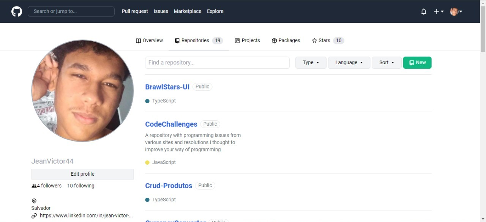
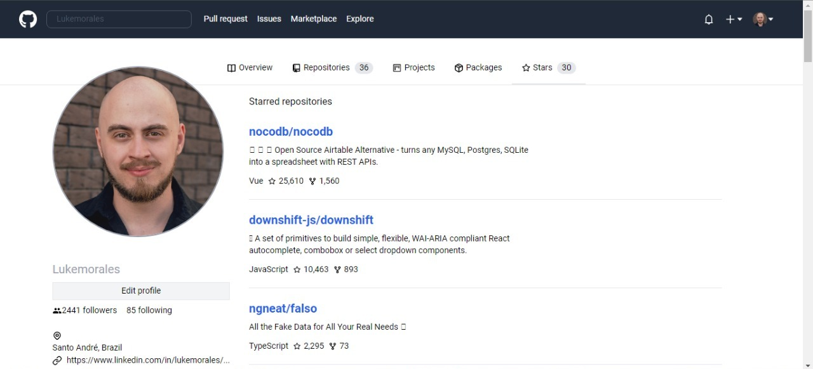

<p align="center">
  
<p>

<p align="center">
  

  

  
  <a href="https://github.com/JeanVictor44/Github-Clone/commits/main">
    
  </a>

  
</p>


## :computer: Sobre o projeto
Github clone é um projeto de clonagem da aplicação web, GitHub, tendo como principal funcionalidade a visualização das informações dos usuários da aplicação, fazendo consumo da api fornecida pelo próprio github, a biblioteca React JS, hooks, context api e Tailwindcss usando o método de aprendizado através da aplicação prática.



> Página principal

## :art: Layout
<p align="center" style="display: flex; align-items: flex-start; justify-content: center;">
    
</p>

## :hammer_and_wrench: Tecnologias

As seguintes ferramentas foram usadas na construção do projeto:

- [React ](https://pt-br.reactjs.org/)
- [TypeScript](https://www.typescriptlang.org/)
- [React-Router-Dom v6](https://reactrouter.com/docs/en/v6)
- [Tailwindcss](https://tailwindcss.com/)
- [Npm](https://www.npmjs.com/)


## Pré-requisitos

Antes de começar, você vai precisar ter instalado em sua máquina as seguintes ferramentas:
[Git](https://git-scm.com), [Node.js](https://nodejs.org/). Além disto é bom ter um editor para trabalhar com o código como [VSCode](https://code.visualstudio.com/)

### :coffee: Rodando a aplicação 

```bash
# Clone este repositório
$ git clone https://github.com/JeanVictor44/Github-Clone

# Acesse a pasta do projeto no seu terminal/cmd
$ cd Github-Clone

# Instale as dependências
$ npm install

# Execute a aplicação em modo de desenvolvimento
$ npm run start
      ou
$ yarn dev

# A aplicação será aberta na porta:3000 - acesse http://localhost:3000
```


## :pencil: Licença

Esse projeto está sob licença. Veja o arquivo [LICENÇA](LICENSE) para mais detalhes.
